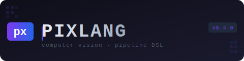

# PixLang

<p align="center">
  
</p>

**A minimal, human-readable DSL for computer vision pipelines.**

[](https://github.com/yourusername/pixlang/actions)
[](https://python.org)
[](LICENSE)
[]()

---

## What is PixLang?

PixLang is a line-based domain-specific language for describing image processing pipelines. Write readable, reproducible, versionable vision workflows — no Python boilerplate required.

```
# inspection.pxl
SET width  640
SET height 480

LOAD "part_photo.jpg"
RESIZE $width $height
ASSERT width == 640

CHECKPOINT "original"
INCLUDE "preprocess.pxl"

FIND_CONTOURS
DRAW_BOUNDING_BOXES
OVERLAY "original" 0.3

DRAW_TEXT "INSPECTION v1.2" 12 35 1.0 255 255 80 2 "duplex"
COMPARE "original"
SAVE "output/result.png"
```

---

## Features

| Category | Feature |
|---|---|
| **Language** | Variables (`SET`/`$ref`), conditionals (`IF`/`ENDIF`), loops (`REPEAT`/`END`), line continuation (`\`) |
| **Composition** | `INCLUDE` sub-pipelines with shared context |
| **Validation** | `ASSERT` runtime checks (width, height, channels, min, max, contour_count) |
| **ROI** | `ROI x y w h … ROI_RESET` — process masked regions, auto-paste back |
| **Batch** | `LOAD_GLOB` + `SAVE_EACH` — multi-file runs with template filenames |
| **Plugins** | Entry-points, local `.plugins.py`, directory discovery |
| **Linter** | 11 rules, `pixlang lint`, integrated into watch mode |
| **Watch** | `pixlang watch` — file-change polling with auto-rerun |
| **Config** | `pixlang.toml` — project-level variables, defaults, lint overrides |
| **35 commands** | I/O · Geometry · Color · Threshold · Filter · Morphology · Analysis · Annotation |

---

## Installation

```bash
git clone https://github.com/yourusername/pixlang.git
cd pixlang
pip install -e .

# Generate a sample image and run:
python scripts/make_sample.py
pixlang run examples/pipeline.pxl --verbose
```

---

## CLI Reference

```bash
pixlang run      pipeline.pxl [--verbose] [--no-plugins] [--batch]
pixlang lint     pipeline.pxl
pixlang watch    pipeline.pxl [--verbose] [--interval 0.5]
pixlang validate pipeline.pxl
pixlang commands [--source builtin]
pixlang plugins
pixlang new      <project-name>
pixlang --version
```

---

## Language Reference

### Variables
```
SET width  640
SET height 480
SET mode   "inspect"

LOAD "image.jpg"
RESIZE $width $height   # with $ prefix
RESIZE width height     # bare name also works
```

### Line Continuation

Long argument lists can be split across multiple lines using a trailing backslash:

```
DRAW_TEXT \
    "Defect detected" \
    12 35 \
    1.0 255 80 80 2

DRAW_TEXT "Defect detected" 12 35 1.0 255 80 80 2   # identical
```

Any command can use `\` at the end of a line to continue on the next.
Indentation after `\` is ignored.

### Conditionals
```
SET threshold 128

IF threshold > 100
    THRESHOLD_OTSU
ENDIF
```

Operators: `==` `!=` `<` `>` `<=` `>=`

### Loops
```
REPEAT 3
    ERODE 3 1
    DILATE 3 1
END
# $ITER = 0-based, $ITER1 = 1-based counter inside loop
```

### Pipeline Composition
```
LOAD "image.jpg"
INCLUDE "preprocess.pxl"   # runs relative to this file's directory
FIND_CONTOURS
SAVE "output.png"
```

### Validation
```
ASSERT width  == 640  "Must resize to 640 first"
ASSERT height >= 100
ASSERT channels == 3
ASSERT contour_count >= 1  "No objects detected"
```

Subjects: `width` `height` `channels` `min` `max` `contour_count` `ndim`

### ROI (Region of Interest)
```
ROI 0 0 320 240
    GRAYSCALE
    THRESHOLD_OTSU
    FIND_CONTOURS
    DRAW_BOUNDING_BOXES
ROI_RESET
```

### Batch Processing
```
LOAD_GLOB "frames/*.jpg"
RESIZE 640 480
GRAYSCALE
THRESHOLD_OTSU
SAVE_EACH "output/{stem}_processed.png"
```

Template vars: `{stem}` `{name}` `{ext}` `{index}` `{index1}` `{dir}`

---

## Command Summary

<details>
<summary>View all 35 commands</summary>

**I/O:** `LOAD` `SAVE` `PRINT_INFO` `LOAD_GLOB` `SAVE_EACH`

**Geometry:** `RESIZE` `RESIZE_PERCENT` `CROP` `ROTATE` `FLIP` `AUTO_CROP`

**Color:** `GRAYSCALE` `INVERT` `NORMALIZE` `EQUALIZE_HIST` `HEATMAP`

**Threshold:** `THRESHOLD` `THRESHOLD_OTSU` `ADAPTIVE_THRESHOLD`

**Filters:** `BLUR` `MEDIAN_BLUR` `SHARPEN` `CANNY`

**Morphology:** `DILATE` `ERODE`

**Analysis:** `FIND_CONTOURS` `COMPARE` `HISTOGRAM_SAVE` `PIPELINE_STATS`

**Annotation:** `DRAW_BOUNDING_BOXES` `DRAW_CONTOURS` `DRAW_TEXT`

**Compositing:** `CHECKPOINT` `OVERLAY` `BLEND`

</details>

---

## Plugin System

Three discovery mechanisms, tried in order:

1. **Entry-points** — any installed package declaring `[project.entry-points."pixlang.commands"]`
2. **Local file** — `pipeline.plugins.py` auto-loaded alongside the `.pxl` file
3. **Directory** — `~/.pixlang/plugins/` or `$PIXLANG_PLUGIN_DIR`

**Writing a plugin:**
```python
# my_plugin.py
def register(registry):
    @registry.register("MY_COMMAND", source="my-plugin")
    def cmd_my(image, param: int = 10):
        """MY_COMMAND [param] — does something."""
        from pixlang.commands.builtin import _unwrap, _wrap
        img, meta = _unwrap(image)
        # ... process img ...
        result = _wrap(img)
        result.update(meta)
        return result
```

Drop it in `~/.pixlang/plugins/` — it's available immediately.

---

## Project Config (`pixlang.toml`)

```toml
[defaults]
verbose = false
plugins = true
lint    = true

[variables]
width  = 640
height = 480
mode   = "production"

[lint]
ignore = ["PX006"]

[batch]
output_dir = "output"
```

PixLang searches for `pixlang.toml` in the pipeline directory and parent directories.

---

## Linter Rules

| Code | Severity | Description |
|---|---|---|
| PX001 | ERROR | Pipeline does not start with LOAD |
| PX002 | WARNING | No SAVE — output never written |
| PX003 | WARNING | FIND_CONTOURS without a draw command |
| PX004 | ERROR | OVERLAY references undefined CHECKPOINT |
| PX005 | ERROR | `$variable` used but never SET |
| PX006 | INFO | Identical consecutive commands |
| PX007 | WARNING | RESIZE after filtering step |
| PX008 | ERROR | REPEAT with count ≤ 0 |
| PX009 | INFO | Empty pipeline |
| PX010 | WARNING | THRESHOLD before GRAYSCALE |
| PX011 | ERROR | Unknown command name |

---

## Architecture

```
pixlang/
├── parser/         lexer → AST → recursive descent parser
├── commands/       registry + 35 built-in OpenCV handlers
├── executor/       AST walker, variable store, IF/REPEAT/ROI/INCLUDE/ASSERT
├── plugins/        three-tier discovery loader
├── linter/         11-rule static analyser
├── watcher/        polling file-change detector
├── batch/          LOAD_GLOB / SAVE_EACH / BatchRunner
└── config/         pixlang.toml discovery + parser
```

---

## Testing

```bash
pytest                    # 218 tests
pytest --cov=pixlang      # with coverage
pytest tests/test_v4.py   # v0.4 only
```

---

## Roadmap

- [ ] v0.5 — `FOR file IN glob … END` explicit loop syntax
- [ ] v0.5 — `FUNC name … END` / `CALL name` user-defined commands
- [ ] v0.6 — ONNX model inference (`INFER model.onnx`)
- [ ] v0.6 — Named ROI with labels (`ROI_NAME "bolt_zone" …`)
- [ ] v0.7 — Web UI editor with live preview
- [ ] v1.0 — Language spec, stable API, PyPI release

---

## License

MIT — see [LICENSE](LICENSE).
